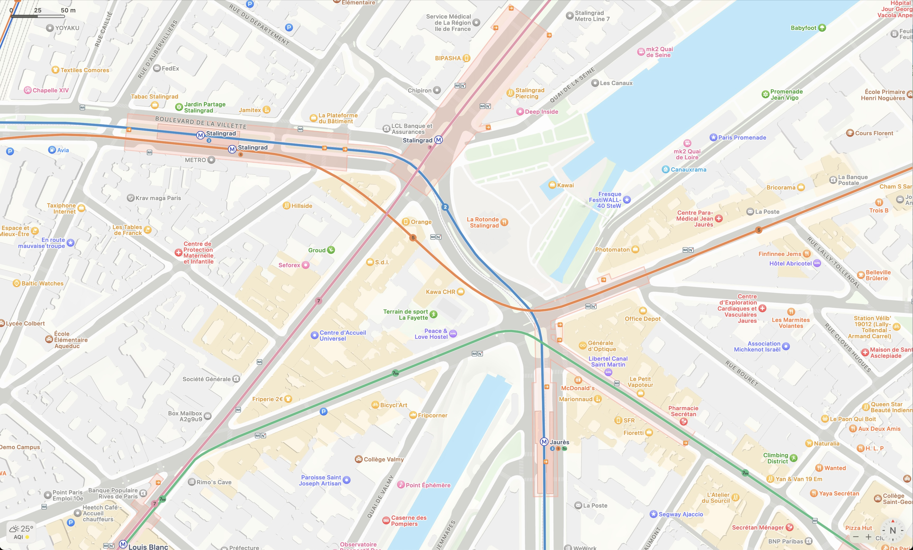

General Transit Feed Specification (GTFS) est un format de données qui permet de décrire les horaires de transport en
commun.

Je vous propose de revenir sur ma découverte et mon utilisation de ce format de données
grâce à un projet personnel.

Une collègue, Marianne, m'a parlé d'un jeu qu'elle faisait de tête avec ses amis : décrire le trajet pour aller d'une
station à une autre. J'ai trouvé l'idée intéressante et j'ai décidé de créer un jeu similaire
à [Travle.earth](https://travle.earth/), mais pour le métro de Paris.

## Problèmes rencontrés avec les données d'OSM

Pour le Minimum Viable Product (MVP), j'ai décidé d'implémenter une première version qui se base sur les données
d'[OpenStreetMap (OSM)](https://www.openstreetmap.org/) que j'ai pu récupérer grâce
à une requête sur [Overpass Turbo](https://overpass-turbo.eu/). J'ai ainsi pu générer un
graphe des stations et des connexions entre elles plutôt simplement. J'ai d'ailleurs utilisé pour la première fois
l'algorithme de Dijkstra, pour trouver le plus court chemin entre deux stations, autre que pour Advent Of Code.

Cependant, j'ai vite rencontré des problèmes pour les lignes qui ont des boucles comme la 7bis, due à la modélisation
qui n'était pas idéale. Cela vient du fait que je stocke l'index de la station sur la ligne, et ses voisines sont donc
l'index + 1 et -1.
Pour simplifier les choses, j'ai abandonné la boucle dans le MVP.

Aussi, je n'avais pas les correspondances entre stations reliées par des tunnels piétons comme Saint-Lazare et
Saint-Augustin.

Et enfin, le dernier gros souci, c'est que mon implémentation de Dijkstra ne prenait pas en compte les coûts liés aux
correspondances.
Souvent, la solution ne semblait pas très naturelle avec plusieurs changements au lieu de rester sur la même ligne. Par
exemple, pour aller de Miromesnil à Brochant, le trajet proposé était de prendre la 13, puis la 14 à Saint-Lazare
jusqu'à Pont Cardinet pour enfin revenir sur la 13 et aller dans le sens inverse pour Pont-Cardinet à Brochant.
Le plus naturel est de rester dans la 13 de Miromesnil à Brochant.
L'algorithme proposait ce trajet, car c'est ce qui prenait le moins de stations.

Pour améliorer l'algorithme, et répondre aux problématiques de boucle, de placement des stations, des correspondances,
et aussi proposer un mode basé sur le temps, il me fallait un autre format de données. C'est là que j'ai découvert GTFS.

## Transition vers GTFS

### Découverte de GTFS

GTFS propose un format de données standardisé pour les horaires de transport en commun.
Proposé par Google en 2006, le nom était : Google Transit Feed Specification. Le G a été remplacé en 2010 pour devenir
"General" pour démocratiser le format. Il est basé sur des fichiers CSV, et est utilisé par de nombreuses villes dans le
monde comme Paris, qui nous intéresse ici.

Donc un avantage en plus d'utiliser ce format est que je pourrais éventuellement proposer le jeu pour d'autres villes.

Plongeons dans le format GTFS, et voyons comment il est structuré et comment je peux l'exploiter pour le jeu. Je vais
parler principalement de l'implémentation faite par Île-de-France Mobilités (IDFM).

Le format propose plusieurs fichiers reliés entre eux par des clés étrangères, du relationnel en somme.

- `agency.txt` : Informations sur les agences de transport
- `stops.txt` : Informations sur les stations
- `routes.txt` : Informations sur les lignes
- `trips.txt` : Informations sur les trajets
- `stop_times.txt` : Informations sur les horaires
- `calendar.txt` : Informations sur les jours de service
- `calendar_dates.txt` : Informations sur les exceptions de service
- `transfers.txt` : Informations sur les correspondances

Pour résumer, une agence de transport a des arrêts `stops`, qui correspondent à des quais, arrêts de bus, etc. La table
de `stop_times` défini pour un voyage `trip`, l'horaire de passage à un arrêt et son indice dans le voyage. Un voyage
est défini par une ligne (`route`), un arrêt d'arrivée, et un calendrier.

Voilà, pour ce qui est du format des données, je vous conseille si ça vous intéresse d'en savoir plus le site
de [GTFS](https://gtfs.org/), [la documentation du GTFS appliqué par
IDFM](https://eu.ftp.opendatasoft.com/stif/GTFS/opendata_gtfs.pdf), ainsi
que [le bouquin gratuit de Quentin Zervaas](https://github.com/MobilityData/GTFS-books)

### Utilisation du GTFS

Pour utiliser les données, je les ai ingérées dans une base de données PostgreSQL, et ensuite grâce à des requêtes SQL,
j'ai pu récupérer une partie de ce dont j'avais besoin :

- les lignes
- les stations de métro
- les stations voisines
- le temps entre deux stations voisines
- toutes les correspondances
- le temps de correspondance

Cependant, ce standard n'oblige pas à fournir toutes les informations pratiques pour afficher correctement sur une
carte le réseau de transport. Regardons les limites du GTFS.

### Limites du GTFS

Les données n'étant pas les plus justes, il faut souvent se créer sa propre source de vérité.

#### Données incomplètes

Le GTFS fournit les données sur 30 jours. Si durant ces 30 jours une station est fermée alors celle-ci n'est plus dans
le GTFS.
Par exemple, la station Concorde durant les Jeux Olympiques est fermée de juin à septembre. Celle-ci ne sera donc pas
présente dans le fichier `stop_times`, ce qui implique que vous ne connaitrez pas les lignes qui la desservent, car
l'arrêt n'y est pas fait.
Dans le fichier `stops` on retrouve alors la station Concorde qui n'est pas dans `stop_times.txt` et par conséquent
n'est pas lié à un voyage, ni à une ligne.
Si nous souhaitons tracer tout de même la ligne, ou marquer que les lignes qui desservent cette station, il faudra faire
du spécifique.

#### Point géographique lié à une station

Un autre point que je trouve dommage dans cette spécification, c'est qu'une station a plusieurs arrêts, mais comme les
stations n'ont pas de représentations dans le GTFS, alors il n'existe pas de point unique géographique pour une station.
Si nous prenons plusieurs représentations des données, OSM, Apple Maps, Google Maps. Ces 3 cartes ont la couche "
Transport" d'activée.

Voici le tableau récapitulatif des positions géographiques pour chaque carte :

| Produit     | Jaurès              | Stalingrad          |
|-------------|---------------------|---------------------|
| OSM         | 48.882594, 2.370330 | 48.884244, 2.367076 |
| Google Maps | 48.882731, 2.370461 | 48.884431, 2.365820 |
| Apple Maps  | 48.881714, 2.370247 | 48.884251, 2.368902 |

Nous constatons que chacun utilise des emplacements différents pour les stations.

Sur Apple Maps (la 3ème capture d'écran), nous observons que la station Stalingrad a plusieurs points, un pour chaque
ligne, mais ce n'est pas le cas pour la station Jaurès qui a aussi plusieurs lignes. On peut donc se demander quelles
sont les règles d'affichages ?
D'ailleurs, lorsqu'on copie les coordonnées géographiques de la station de n'importe quel
point de la station Stalingrad, une seule paire de coordonnées est copiée (48.884251, 2.368902), donc pourquoi en
afficher plusieurs ?
Toujours sur la carte d'Apple, nous constatons que la forme de la station est tracée en rouge, ce qu'on ne voit pas
sur OSM et Google Maps.
En regardant de plus
près [la provenance des données d'Apple](https://gspe21-ssl.ls.apple.com/html/attribution-277.html), nous lisons qu'une
partie des données proviennent d'OpenStreetMap. Cependant, la ligne 5 n'a pas le même tracé, et la station Jaurès
n'est pas tracée au même endroit. Ce qui me laisse penser que ce n'est pas le cas du transport à Paris. J'ai la
confirmation, plus bas dans la liste des fournisseurs, où nous pouvons lire :
> France transit data processed by Hove from sources
> including [transport.data.gouv.fr](https://transport.data.gouv.fr), SNCF, and others.
> [transport.data.gouv.fr](https://transport.data.gouv.fr) data made available under the Open Database License (ODbL).
> Modifications to the data
> available [here](https://navitia.opendatasoft.com/explore/?sort=modified&q=france&refine.geographicarea=France).

Les données d'Apple Maps sont donc celles fournies par IDFM à transport.data.gouv.fr, puis traitées par Hove.

[IDFM propose un jeu de donnée généralisée](https://prim.iledefrance-mobilites.fr/fr/jeux-de-donnees/emplacement-des-gares-idf-data-generalisee),
où justement il n'y a qu'un seul point géographique pour chaque station.
On peut se demander pourquoi les consommateurs des données d'IDFM ne l'utilisent pas.
Ce jeu de données n'a pas d'identifiant unique pour faire le lien avec les données du GTFS, et c'est un réel
problème. Il faut donc faire du spécifique avec des règles pour faire le lien entre les deux.

// A VOIR POUR REMONTER CETTE PARTIE OU LA SUPPRIMER :
Si nous comparons les données généralisées, avec celle d'Hove, nous pouvons voir qu'il ne s'agit pas des mêmes
emplacements et il en est de même pour OSM qui se trouve sur la capture d'écran (les données généralisées sont les
repères rouges). Les grands acteurs n'utilisent donc pas ce jeu de données.

// FIN DE LA PARTIE

// VOIR POUR FAIRE LE MEME EXERCICE AVEC GMAPS ET OSM

Dans mon cas, je me suis amusé à utiliser ces données. Il a fallu faire une normalisation des noms et des expressions
régulières pour faire le lien des stations entre le GTFS et ce jeu de
données, [mais ce n'est pas si simple](https://github.com/VincentHardouin/metro-travel/blob/29cdac26485ee8b61b325c52e19ab250db608b21/scripts/extract-data.js#L184-L213).
J'ai d'ailleurs contacté IDFM sur leur Slack consacrée aux données et eux-mêmes ne savent pas comment faire le lien.

#### Tracé des lignes

Si nous regardons à nouveau les captures d'écran de la partie précédente, nous
pouvons voir que le tracé des lignes n'est pas identique sur les trois applications.

Actuellement, le standard n'oblige pas les acteurs à fournir toutes les données, comme c'est le cas du
fichier `shapes.txt` qui décrit le tracé des lignes.
IDFM ne fournit pas les tracés des lignes dans le fichier `shapes.txt`, mais le fournit dans un fichier à part. Ce qui
implique que chaque utilisateur des données doit s'adapter en fonction de chaque ville et s'accommoder.

L'imposer dans le standard permettrait de simplifier la vie des utilisateurs des données, et de garantir une certaine
cohérence et réutilisabilité des données.

## Conclusion

Grâce aux données contenues dans le GTFS, j'ai pu répondre à certaines problématiques que je n'arrivais pas à résoudre
avec les données d'OSM, comme connaitre le temps de trajet entre deux stations, les correspondances.
Cela m'a aussi permis de plonger dans ce format de données, et d'y découvrir différentes limites : données à consolider,
pas de point géographique unique pour une station, pas de tracé des lignes obligatoire dans le GTFS.
On a pu voir les impacts que cela engendre pour les différents utilisateurs de ses données, et nous avons vu les
améliorations possibles à mettre en place pour contrer cela.

// TODO : Parler du cas de la ligne 9 avec l'arrêt exceptionnel, qui fausse le calcul des stations adjacentes

## Ressources

- [Travle.earth](https://travle.earth/)
- [OpenStreetMap (OSM)](https://www.openstreetmap.org/)
- [Overpass Turbo](https://overpass-turbo.eu/)
- [GTFS](https://gtfs.org)
- [Documentation IDFM](https://eu.ftp.opendatasoft.com/stif/GTFS/opendata_gtfs.pdf)
- [Livres gratuits sur le GTFS](https://github.com/MobilityData/GTFS-books)
- [Provence des données Apple Maps](https://gspe21-ssl.ls.apple.com/html/attribution-277.html)
- [transport.data.gouv.fr](https://transport.data.gouv.fr)
- [Jeu de données "Gares et stations du réseau ferré d'Île-de-France (donnée généralisée)"](https://prim.iledefrance-mobilites.fr/jeux-de-donnees/emplacement-des-gares-idf-data-generalisee)
- [Extrait du code de Métro Travel pour faire le lien entre les arrêts du GTFS et le jeu de données "Gares et stations du réseau ferré d'Île-de-France (donnée généralisée)"](https://github.com/VincentHardouin/metro-travel/blob/29cdac26485ee8b61b325c52e19ab250db608b21/scripts/extract-data.js#L184-L213)