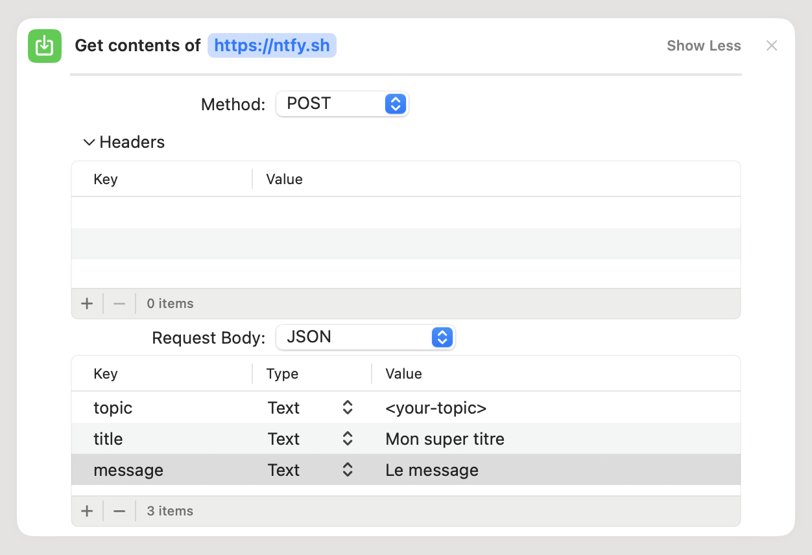

## Contexte

Apple propose Shortcuts depuis 2018. C'est une application qui permet de créer/utiliser des automations sur iOS, macOS
et plus récemment pour HomeKit en se lançant sur le Hub de la maison.
Cependant, du fait que ces automatisations s'exécutent directement sur le Hub de la maison, elles ne peuvent pas
bénéficier des applications tierces telles que PushCut, Controller, Scriptable, qui simplifient ces processus.

Nous allons donc explorer une méthode pour contourner cette limitation et envoyer des notifications via les
automatisations HomeKit.

## Prérequis

Un Hub HomeKit (Apple TV, HomePod, iPad)

## Recevoir des notifications

Dans mon idée, je voulais que les personnes concernées par une notification en reçoivent une.
Par exemple, si la dernière personne qui part de la maison a oublié de ferme les fenêtres, alors elle reçoit une
notification.

Dans les faits, il n'est pas possible de faire cela avec les automations HomeKit, car il n'est pas possible de savoir
qui a déclenché l'automation.

Nous allons donc créer une automation qui va envoyer une notification à toutes les personnes de la maison.

Pour envoyer la notification, l'idéal serait de pouvoir le faire via une requête HTTP. Cela tombe bien, car il existe
un service qui permet de faire cela : [Ntfy](https://ntfy.org/).

### Plan Gratuit de Ntfy

Le plan gratuit de Ntfy autorise l'envoi de 250 notifications par mois, amplement suffisant pour notre usage. Si vous
souhaitez soutenir le projet, vous pouvez prendre un abonnement ou le sponsoriser.

La limitation du plan gratuit est de ne pas pouvoir protéger les topics.
Il faut donc générer un topic avec un nom aléatoire et surtout, il ne faudra jamais publier d'information personnelle
dessus.

### Self-hosted

Si vous préférez, vous pouvez aussi héberger votre propre instance de Ntfy, en suivant les instructions de
[la documentation de Ntfy](https://docs.ntfy.sh/install/).

Attention à bien protéger votre
instance, [en activant les contrôles d'accès](https://docs.ntfy.sh/config/#access-control).

### Télécharger l'application Ntfy

Une fois votre topic créé, vous pouvez télécharger l'application Ntfy sur votre téléphone, puis vous devez vous abonner
à votre topic.

### Envoi d'une notification

Vous pouvez ensuite essayer d'envoyer une notification depuis un terminal avec la commande suivante :

```shell
curl -X POST -H 'Title: Titre de la notification' -d 'Ceci est un test ' https://ntfy.sh/<topic>
```

Maintenant, nous savons recevoir des notifications, nous allons pouvoir créer notre automation qui envoie cette
notification.

## Créer une automation

Nous allons sur l'application Home, puis sur l'onglet Automation, puis sur le bouton + en haut à droite.

Pour l'exemple, nous allons choisir le déclencheur "Quand la dernière personne quitte la maison".
Nous voulons ensuite faire un shortcut, donc tout en bas, nous choisissons "Convertir en raccourci".
Puis, nous ajoutons l'action "Récupérer une page web".

Nous choisissons ensuite la méthode POST, et là le drame.
Nous pouvons voir qu'Apple propose uniquement du JSON, un formulaire ou des fichiers, mais pas de texte brut, nous
sommes bien embêtés.

Heureusement, Ntfy a prévu ce cas avec la possibilité d'appeler la ressource `/` avec du JSON.

Notre curl précédent devient donc :

```shell
curl -X POST -d '{ "topic:"<topic>", "title": "Titre de la notification", "message": "Ceci est un test" }' https://ntfy.sh/
```

Notez que le topic est désormais dans le JSON.

Nous pouvons donc finaliser notre action :



## Conclusion

Ntfy, nous a permis d'envoyer des notifications depuis les automations HomeKit. Nous pouvons aussi nous en servir depuis
les Shortcuts, et reste une solution intéressante pour envoyer des notifications depuis un script.

N'hésitez pas à soutenir le projet si vous l'utilisez ! 