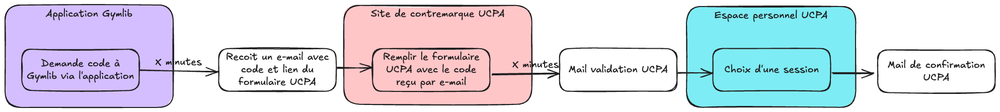
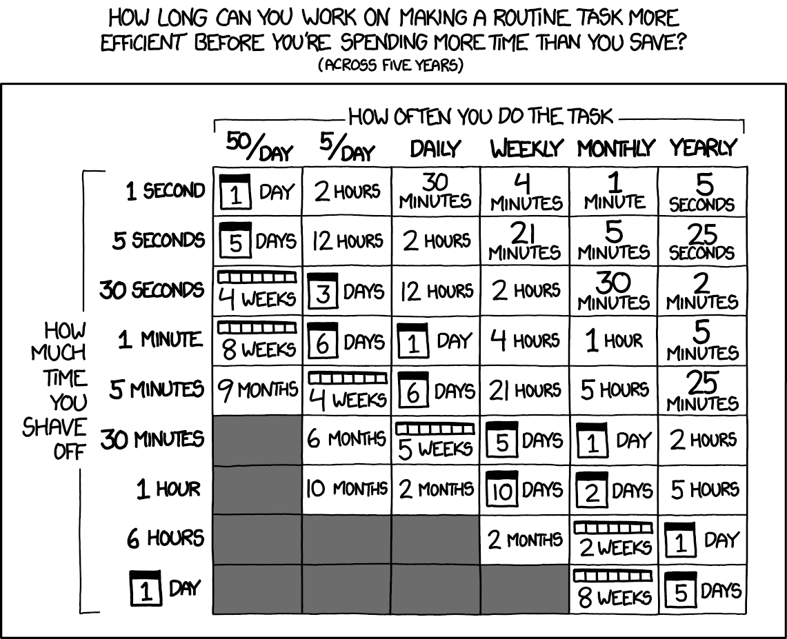
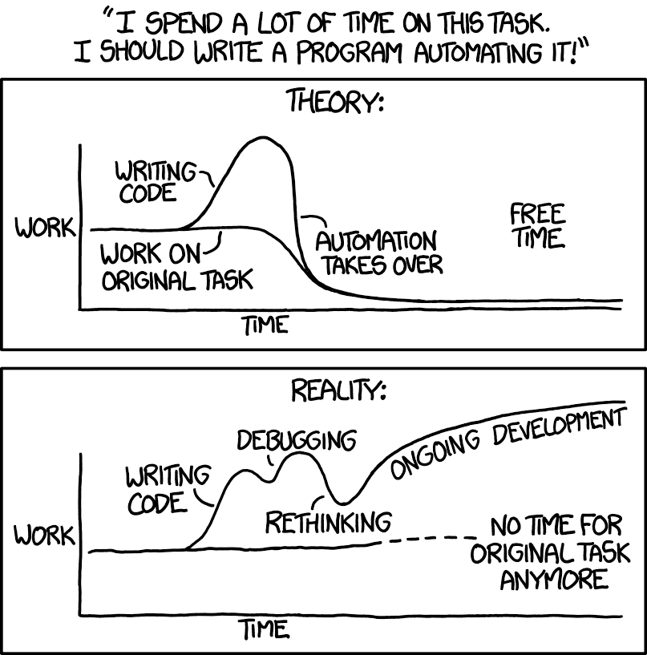

Nous sommes début 2025 et vous avez sûrement pris de bonnes résolutions pour cette année. Souvent cela rime avec de
nouvelles habitudes. Je profite de cette période pour vous partager comment j'ai conservé une habitude en automatisant
un irritant.

L'année 2024 a marqué mon véritable retour au sport, après des années passées en salle de sport sans grande conviction.
Elle a débuté avec la natation, mais les horaires des piscines de Paris et ma motivation n'étaient pas compatibles.
Elle s'est poursuivie avec le badminton. Aujourd'hui, je partage mes entraînements entre mon club et des
réservations de terrains à l'[UCPA Sport Station](https://www.ucpa.com/sport-station/paris-19). Pour ces réservations,
j'utilise [Gymlib](https://gymlib.com/fr), une application d'abonnement de sport partiellement pris en charge par mon
employeur.

Comme le souligne James Clear dans Atomic Habits "If you want to increase the odds that a behavior will occur, then you
need to make it attractive.”. Or, la complexité de réservation via Gymlib pour l'UCPA va à l'encontre de ce principe, au
point que cela aurait pu compromettre ma nouvelle habitude.

## Problème

La réservation d'une séance à l'UCPA via Gymlib est fastidieuse. Voici les différentes étapes.



Pour résumer, je fais une demande de code via Gymlib, je reçois un e-mail avec le code après quelques minutes. Puis je
peux remplir le formulaire de contremarque, ce qui permet à l'UCPA de ne pas me facturer, mais de facturer Gymlib, et entre
10min et quelques heures, je reçois la validation de l'UCPA qui m'a crédité un e-billet sur mon compte UCPA.

Le réel problème ce sont les différents temps d'attente qui poussent à faire autre chose entre temps et oublier de
réaliser la réservation, c'est mon irritant.
Ensuite, je me demande s'il est intéressant d'automatiser cette tâche:  est-ce que je le fais assez souvent ?
Ce projet a pour vocation d'être utilisé 3 fois par mois, ce qui correspond à la limite de mon abonnement
Gymlib. Et la réservation me prend 5min, mais avec les temps d'attente cela peut aller de trente minutes à quelques
heures.

J'aime bien le schéma comique de [xkcd](https://xkcd.com/) "Is It Worth the Time?" , qui montre le temps maximum à allouer pour automatiser une
tâche en fonction de sa durée et sa récurrence.



Dans mon cas, le calcul correspond à : 3 occurrences / mois (ce qui correspond entre hebdomadaire et mensuel sur le
schéma) * 5 ans (la durée utilisée sur le schéma) = 180 occurrences
180 occurrences * 30 min en moyenne économisées = 5400 minutes = 90h = 3,75 j ce qui est bien comparable au schéma.

Le schéma donne des exemples sur 5 ans, mais en réalité 2 ans me paraissent plus raisonnables, ce qui donne 72
occurrences et par conséquent 36h.
Les différentes tâches doivent être automatisées en moins de 36h, ce qui me semble réalisable.

Pour que l'automatisation soit "rentable", je ne dois pas mettre plus de 36h à l'automatiser.
Parfois, ce n'est pas rentable de le faire, mais il est nécessaire de se demander :

- est-ce que l'irritant est assez fort pour rechigner à le faire
- voire, est-ce que cela peut me faire perdre mon habitude ?

Un cas plus concret :  si vous prenez une salle de sport à 1h de chez vous, versus une salle de sport sur votre chemin de
retour du boulot, il y a de forte chances que l'habitude s'ancre dans le second cas plutôt que le premier.
Dans le cas des réservations, il est probable que cela puisse m’en faire manquer, ou me rebuter à les
faire, ce qui aura tendance à couper une habitude. Vous savez les fameux streaks qu'il ne faut pas casser.
Le risque est de manquer ou retarder certaines réservations, ce qui peut briser la régularité de la
pratique. Le principe du ["Don't Break the Chain"](https://jamesclear.com/stop-procrastinating-seinfeld-strategy), popularisé par Jerry Seinfeld et repris par James Clear
souligne l'importance de maintenir une pratique régulière sans interruption. Chaque séance manquée à cause d'une
réservation non effectuée représente donc un risque pour la pérennité de cette nouvelle habitude sportive.

Une fois cette analyse faite et conscient que cette friction pourrait compromettre ma nouvelle habitude, j'ai décidé d'
entreprendre un MVP (Minimum Valuable Product).

## MVP

J'ai pris le parti d'automatiser l'étape de contremarque en premier. Mon idée était donc de récupérer les e-mails
spécifiques à un code UCPA par Gymlib et remplir le formulaire de contremarque. Pour lire les e-mails, j'ai utilisé le
package [`imapflow`](https://github.com/postalsys/imapflow), combiné à [
`mailparser`](https://github.com/nodemailer/mailparser) pour récupérer plus facilement le code dans l'e-mail.
Le détail de l'implémentation se trouve [sur GitHub](https://github.com/VincentHardouin/gymlib-ucpa-facilitator/blob/1af15b16652091cb6466a64ccbfe6ae2e165cbf1/src/infrastructure/adapters/MailAdapter.js), voici les étapes principales :

- se connecter à la boite e-mail avec `imapflow` :

```javascript
class MailAdapter {
    ...
    async getConnectedClient() {  
      const client = new ImapFlow({  
        host: this.host,  
        port: this.port,  
        secure: true,  
        auth: {  
          user: this.user,  
          pass: this.password,  
        },  
        logger: false,  
      });  
      await client.connect();  
      return client;  
    }
}
```

- récupérer le contenu des e-mails avec `mailparser`:

```javascript
class MailAdapter {
    ...
    async fetch(searchQuery) {  
      const client = await this.getConnectedClient();  
      const lock = await client.getMailboxLock('INBOX');  
      const mails = [];  
      try {  
        for await (const rawMail of client.fetch(searchQuery, {  
          source: true,  
          headers: ['date', 'subject'],  
        })) {  
          const mail = await simpleParser(rawMail.source);  
          mails.push({  
            uid: message.uid,  
            date: mail.date,  
            title: mail.subject,  
            html: mail.html,  
            text: mail.text,  
          });  
        }  
      }  
      finally {  
        lock.release();  
      }  
      await client.logout();  
      return mails;  
    }
}
```

Dans le formulaire, les champs à remplir sont identiques, seul le code fourni par Gymlib change, donc
l'automatisation est plutôt simple. La complexité vient du fait que le formulaire contient un jeton CSRF, ce qui fait
qu'on ne peut pas passer par un simple appel API pour envoyer le formulaire (le serveur envoie un champ caché avec
ce fameux jeton). J'ai utilisé [puppeeter](https://pptr.dev/), qui a pour avantage d'automatiser les actions dans un navigateur, ce qui fait
qu'on récupère bien un jeton CSRF avant l'envoi, comme si on le faisait à la main. Pour les différents tests, j'ai mis
en place un feature toggle pour désactiver l'envoi du formulaire. Le détail se
trouve [sur GitHub.](https://github.com/VincentHardouin/gymlib-ucpa-facilitator/blob/1af15b16652091cb6466a64ccbfe6ae2e165cbf1/src/domain/usecases/SubmitFormUseCase.js)

Après quelques heures de code, je me suis retrouvé avec une application qui lisait les mails provenant de Gymlib et qui
remplissait le formulaire de contremarque. Cela réduit les étapes manuelles à une seule : demander une séance sur
l'application Gymlib. Puis il me reste plus qu'à attendre la validation de l'UCPA par e-mail.
J'ai donc à ce moment-là un bon MVP, hébergé sur mon VPS. Cette première version fonctionnelle m'a permis de valider mon approche.
Encouragé par ces résultats, j'ai décidé d'enrichir la solution avec des fonctionnalités qui simplifieraient encore davantage mon
expérience.

## Nouvelles fonctionnalités

### Notifications de créneaux

J'ai mis en place une notification sur mon téléphone avec les créneaux disponibles aux horaires
qui me plaisent. La réception de l'e-mail de confirmation de l'UCPA déclenche la notification. Pour coder cette
fonctionnalité, j'ai récupéré les créneaux disponibles via l'API de l'UCPA. J'ai stocké par ailleurs les créneaux que je privilégie (dans une variable d'environnement).
Enfin, pour recevoir la notification sur mon téléphone, j'ai pour habitude d'utiliser [Ntfy](https://ntfy.sh/) , qui permet d'envoyer une notification via un appel HTTP. Je décris
déjà Ntfy dans l'article ["Envoyer des notifications avec les automations HomeKit"](/posts/envoyer-des-notifications-avec-les-automations-homekit).

Pour la récupération des créneaux disponibles, le code ressemble à ça :

```javascript
async getAllAvailable(areaId) {  
  const requests = [  
    getDatePlusDays(0),  
    getDatePlusDays(7),  
    getDatePlusDays(14),  
  ].map(async (date) => {  
    return httpAdapter.get(`https://www.ucpa.com/sport-station/api/areas-offers/weekly/alpha_hp?=&reservationPeriod=1&espace=${areaId}&time=${date}&__amp_source_origin=https://www.ucpa.com`, { 'User-agent': USER_AGENT });  
  });  
  
  const availableTimeSlots = [];  
  for (const request of requests) {  
    const { planner } = await request;  
    availableTimeSlots.push(...planner.columns.flatMap(column => column.items).filter(item => item.hasStock));  
  }  
  return availableTimeSlots.map(slot => new TimeSlot({  
    startTimestamp: slot.start_time,  
    startTime: slot.startTime,  
    endTime: slot.endTime,  
    startDate: slot.startDate,  
    stock: slot.stock,  
  }));  
}
```

Mes créneaux horaires de préférence sont stockés en JSON dans cette variable d'environnement.

```env
TIME_SLOTS_PREFERENCES='{  
    "sun": [ '14H00', '15H00' ]
}'
```

Voilà la recherche entre les créneaux disponibles et ceux préférés.

```javascript 
return timeSlots  
  .filter(slot => slot.isConvenient(timeSlotsPreferences))  
  .sort((slotA, slotB) => slotA.isMoreConvenient(slotB, timeSlotsPreferences))
```

Avec la class `TimeSlot` qui a les fonctions `isConvenient` et `isMoreConvenient`:

```javascript
export class TimeSlot {
	...
    isConvenient(timeSlotsPreferences) {  
      return timeSlotsPreferences[this.dayOfWeek]?.includes(this.startTime);  
    }  
      
    isMoreConvenient(slotToCompare, timeSlotsPreferences) {  
      const orderedWeekDays = Object.keys(timeSlotsPreferences);  
      
      const rankDayOfWeekA = orderedWeekDays.indexOf(this.dayOfWeek);  
      const rankDayOfWeekB = orderedWeekDays.indexOf(slotToCompare.dayOfWeek);  
      
      const isOnSameDay = this.dayOfWeek === slotToCompare.dayOfWeek;  
      
      if (!isOnSameDay) {  
        return rankDayOfWeekA - rankDayOfWeekB;  
      }  
      
      return timeSlotsPreferences[this.dayOfWeek].indexOf(this.startTime) - timeSlotsPreferences[slotToCompare.dayOfWeek].indexOf(slotToCompare.startTime);  
    }
}
```

J'avais besoin d'une solution simple pour comparer deux créneaux. L'implémentation a émergé grâce aux tests unitaires : vive le [TDD](https://en.wikipedia.org/wiki/Test-driven_development) !

La notification des créneaux disponibles étant en place, je me suis attaqué à un autre aspect de l'organisation : la
visibilité de mes réservations.

### Calendrier

Pour ne pas oublier mes réservations, je veux voir mes prochaines séances dans mon agenda. Pour cela, j'ai mis en place un calendrier iCal. Pour le créer, j'ai utilisé le package [
`ical-generator`](https://github.com/sebbo2002/ical-generator) qui fait très bien ce qu'il prétend faire.

Pour mettre à disposition le calendrier sous forme d'abonnement, il a fallu mettre en place un serveur web. J'ai
utilisé [hapi](https://hapi.dev/) par simple habitude, étant à l'aise avec ce serveur, cela me fait gagner du temps.

Avec le calendrier en place, il ne me restait plus qu'un dernier irritant à résoudre qui concerne mon arrivée à l'UCPA.

### Pass

L'UCPA utilise un système de QR Code pour gérer l'accès aux installations. Le QR Code d'accès est fourni dans l'
e-mail de confirmation. C'est fastidieux de retrouver l'e-mail correspondant à bonne réservation lorsque j'ai plusieurs
réservation en cours. Pour répondre à ce dernier irritant, j'ai décidé de mettre en place un
pass [Apple Wallet](https://www.apple.com/wallet/), qui se met à jour en fonction de la séance à venir. Pour cela, j'ai
besoin de certificats, disponibles avec licence Apple developper. J'ai commencé à
regarder ce qu'il fallait faire pour créer un pass. En JavaScript, nous avons un package qui facilite la création de
passes`passkit-generator`.

Pour gérer la mise à jour des passes, il est nécessaire d'implémenter cinq routes dans son API, tout est succinctement
documenté
dans [la documentation d'Apple](https://developer.apple.com/documentation/walletpasses/adding-a-web-service-to-update-passes).

```text
POST /v1/devices/{deviceLibraryIdentifier}/registrations/{passTypeIdentifier}/{serialNumber}
GET /v1/devices/{deviceLibraryIdentifier}/registrations/{passTypeIdentifier}
GET /v1/passes/{passTypeIdentifier}/{serialNumber}
DELETE /v1/devices/{deviceLibraryIdentifier}/registrations/{passTypeIdentifier}/{serialNumber}
POST /v1/log
```

Pour envoyer des notifications via Apple Push Notifications, le protocole est HTTP/2, actuellement non supporté par
la méthode `fetch` native de Node.js. La solution fournie
dans [cette issue](https://github.com/nodejs/undici/issues/2750) est d'installer le package `undici` et d'activer
HTTP/2 :

```javascript
import { Agent, setGlobalDispatcher } from 'undici'; 

setGlobalDispatcher(new Agent({ 
   allowH2: true,
}));
```

L'usage de l'API APN dans le cadre des pass n'est pas documenté, ce qui a créé une seconde difficulté. En effet, j'ai dû
trouver [sur StackOverflow](https://stackoverflow.com/a/67495800) que l'en-tête HTTP
`apns-topic` doit maintenant contenir l'identifiant du pass. Une fois ce
point compris, l'appel réseau reste néanmoins très classique.

Le code correspond à cela :

```javascript
async notify(pushToken) {  
  const token = await this._getToken();  
  const headers = {  
    'Authorization': `Bearer ${token}`,  
    'apns-topic': this.topic,  
  };  
  const url = `${this.url}/3/device/${pushToken}`;
  return this.httpAdapter.post(url, headers, {});  
}
```

Lors des modifications du pass, on utilise l'Apple Push Notification APN, mais en réalité il s'agit d'une notification
particulière, car ici nous aucun texte n'est affiché à l'utilisateur. Si nous souhaitons avertir des
changements dans le pass il faut utiliser l'attribut `changeMessage` d'un champ du pass lorsque nous retournons le pass
mis à jour. Apple l'indique au niveau de [la documentation de
`changeMessage`](https://developer.apple.com/documentation/walletpasses/passfieldcontent) : "You must provide a value for the system
to show a change notification". La notification déclenche le fait que le téléphone demande le nouveau pass. Si le
nouveau pass contient des "changeMessage" dans des champs modifiés alors une notification est affichée à l'utilisateur,
ce qui revient pratiquement à la même chose.

Les marques peuvent ainsi communiquer plus facilement avec leurs clients, qui n'ont pas besoin de télécharger une
application, mais qui doivent simplement de posséder une carte de fidélité par exemple. C'est d'ailleurs devenu un
nouveau créneau d'entreprise, on peut noter par exemple [CaptainWallet par Brevo](https://www.captainwallet.com/)

Après avoir implémenté ces améliorations successives, il est temps de prendre du recul sur ce projet et d'en tirer les
enseignements.

## Conclusion

Ce projet d'automatisation s'est révélé être un succès, tant en termes de temps investi que de résultats obtenus. Bien
que le calcul initial basé sur le schéma XKCD nous ait fourni un cadre de réflexion intéressant, il est important de
souligner que dans le contexte d'une habitude, la valeur réelle de l'automatisation va au-delà d'une simple équation
temps/bénéfice. Éliminer un irritant qui pourrait compromettre une habitude positive justifie à mon sens de dépasser le
temps théoriquement "rentable".

D'autre part, ce projet m'a permis d'apprendre des choses sur le fonctionnement des passes Apple Wallet, ce qui pourrait m'être utile à l'avenir.

Il est toutefois important de garder à l'esprit qu'une automatisation n'est jamais vraiment "terminée". Comme tout
système en production, elle nécessite une maintenance régulière et peut demander des ajustements au fil du temps,
aspects qu'il faut prendre en compte dans l'équation globale.

