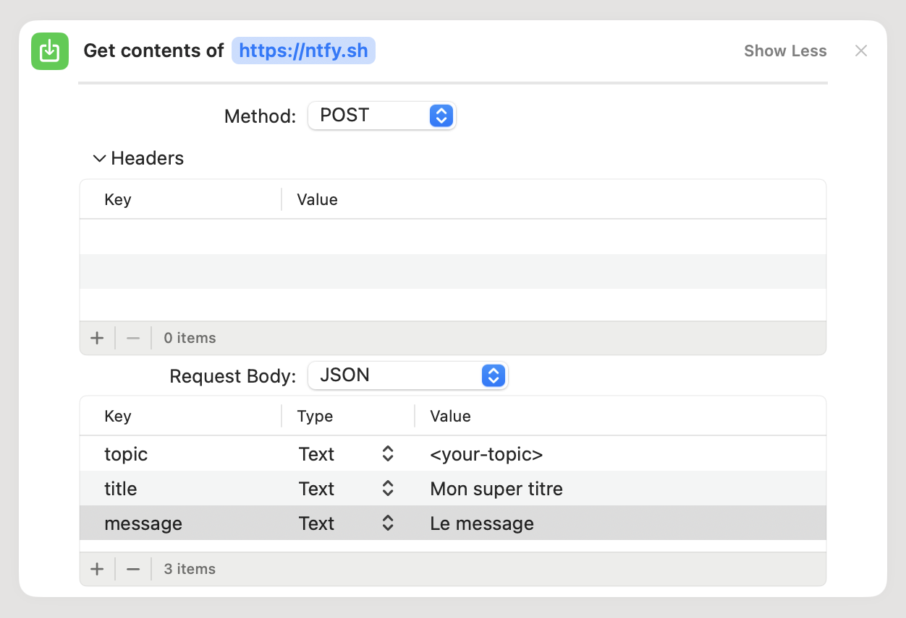

## Context

Apple has been offering Shortcuts since 2018. It's an app that lets you create/use automations on iOS, macOS
and more recently for HomeKit by launching on the Home Hub.
However, because these automations run directly on the Home Hub, they cannot
benefit from third-party applications such as PushCut, Controller, Scriptable, which simplify these processes.

So we're going to explore a method of getting around this limitation and sending notifications via
HomeKit automations.

## Prerequisites

A HomeKit Hub (Apple TV, HomePod, iPad)

## Receiving notifications with NTFY

In my idea, I wanted the people involved in a notification to receive one.
For example, if the last person to leave the house forgot to close the windows, then they'd receive a
notification.

In practice, it's not possible to do this with HomeKit automations, as there's no way of knowing who triggered the
automation.
who triggered the automation.

So we're going to create an automation that will send a notification to everyone in the house.

Ideally, the notification should be sent via an HTTP request. That's ideal, because there's
service that lets you do just that: [Ntfy](https://ntfy.org/).

### Free Tier

Ntfy's free plan allows you to send 250 notifications per month, more than enough for our purposes. If you'd
support the project, you can subscribe or sponsor it.

The limitation of the free plan is that you can't protect your topics.
You'll need to generate a topic with a random name and, above all, never publish personal information on it.
on it.

### Self-hosted

If you prefer, you can also host your own instance of Ntfy, following the instructions in
[Ntfy documentation](https://docs.ntfy.sh/install/).

Be sure to protect your
instance, [by enabling access controls](https://docs.ntfy.sh/config/#access-control).

### Download the Ntfy application

Once you've created your topic, you can download the Ntfy application onto your phone, then subscribe to your topic.
to your topic.

### Send a notification

You can then try sending a notification from a terminal with the following command:

```shell
curl -X POST -H 'Title: Notification title' -d 'This is a test' https://ntfy.sh/<topic>
```

Now that we know how to receive notifications, we can create our own automation to send this
notification.

## Create an automation

We go to Home app, then to the Automation tab, then to the + button in the top right-hand corner.

For the example, we'll choose the trigger "When the last person leaves the house".
We then want to make a shortcut, so at the very bottom we choose "Convert to shortcut".
Then we add the action "Retrieve a web page".

Then we choose the POST method, and there's the drama.
We can see that Apple only offers JSON, a form or files, but not plain text.
so we're in a bit of a bind.

Fortunately, Ntfy has foreseen this case with the possibility of calling the `/` resource with JSON.

Our previous curl thus becomes :

```shell
curl -X POST -d '{ "topic:"<topic>", "title": "Notification title", "message": "This is a test" }' https://ntfy.sh/
```

Note that the topic is now in JSON.

We can now finalize our action:



## Conclusion

Ntfy has enabled us to send notifications from HomeKit automations. We can also use it from Shortcuts
Shortcuts, and remains an interesting solution for sending notifications from a script.

Don't hesitate to support the project if you use it!